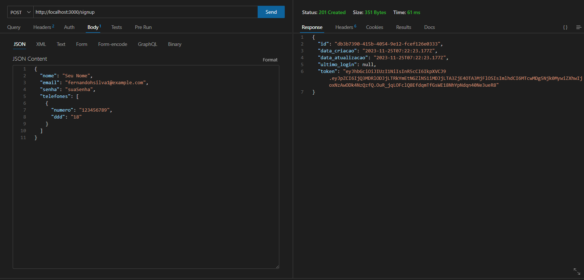
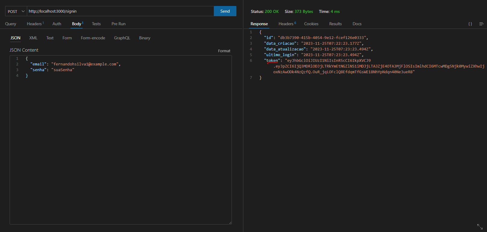
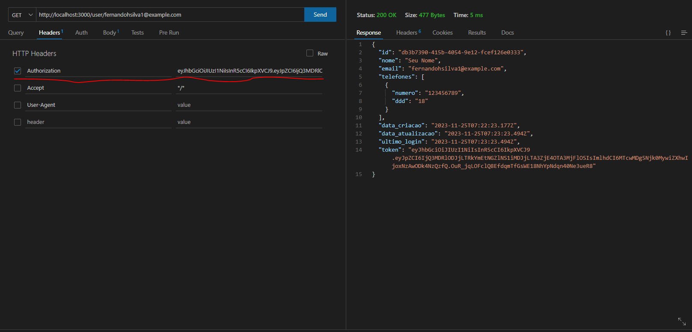

# Secure Connection

Este projeto utiliza uma API RESTful para autenticar usuários, onde há a possibilidade de realizar operações de cadastro (sign up) e autenticação (sign in), além da recuperação de informações de usuário

## Como rodar o projeto?
<b>OBS: Deverá ter instalado o Visual Studio Code juntamente com a sua extensão Thunder Client</b>

1. Abra a raiz do projeto e rode o seguinte comando no terminal:
```
npm install express body-parser jsonwebtoken uuid
```
2. Após a instalação, vá para a pasta src
```
cd src
```
3. Rode o seguinte comando para inicializar o localhost:3000
```
node app.js
```
4. Vá para a extensão do Thunder Client do VS Code e siga os três passos:
   - Coloque o método POST e http://localhost:3000/signup no campo da URL para se cadastrar
   - <b>Anote o e-mail, será importante</b>
   
   

   - Agora, coloque http://localhost:3000/signin no campo da URL para fazer login
   - <strong>Anote o token como está na imagem</strong>
   
   

   - Por fim, mude o método de POST para GET e coloque http://localhost:3000/user/email@email.com
   - <strong>Substitua "email@email.com" pelo e-mail que você criou no passo 1</strong>
   - Em Headers > header, você deverá colocar como Authorization e o value deverá ser o <strong>token</strong> marcado no passo 1 ou 2
   - Clique em send e você verá seus dados de cadastro
     
   
